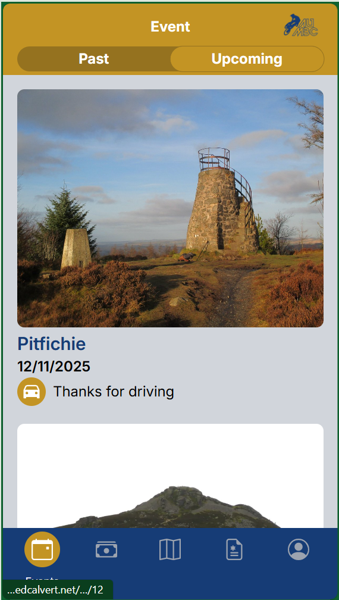

# Shreddin'


An app to improve the user experience of signing up to trips at the University of Aberdeen's Mountain Biking Club. The focus is on simplifying signing up to trips for users, allowing committee members to understand if there is sufficient car space, and will ultimately allow for a simplified payment system based on the concept of zones, based off the mvp at [https://edwardcalvert.github.io/aumbc-zones-mvp/](https://edwardcalvert.github.io/aumbc-zones-mvp/)

Currently, the app is a prototype to explore different interaction types and their suitability for use on a mobile phone. The app is awaiting further requirements elicitation, to understand what should happen when there are more people signed up than there is car space. 

The prototype currently explores:
- Uploading images to an S3 bucket for profile photos
- Tab-based navigation scheme
- Design scheme 
- Using tailwind to create interactive components in a unique style

# react-app

A React Frontend, with Vite and Tailwind. 
Run the app with the command to set the API source: 
```powershell
($env:VITE_API_SOURCE = "https://localhost:<<PORT>>") -and (npm run dev)
```

# web-api

A RESTful API written in ASP.NET Core, using Entity Framework Core. Once running, you can view the OpenAPI specification at `https://localhost:<<PORT>>/swagger/index.html`

To run the app, you will need to supply your own `appsettings.json`, or set the following options using environment variables. The best way to run the app is using Visual Studio 2022, by running the `.sln`. Similarly, when you run the Docker container, you will need to supply the configuration to `/app/appsettings.json` inside the container, and it is highly recommended to add a directory mount for the ASP .NET data protection folder, so that the encryption keys used for cookies are persisted on each deployment, so users aren't forced to sign out. 

Authentication is set through HTTP only cookies, which should automatically refresh half-way through the validity period.

```json

{
  "Logging": {
    "LogLevel": {
      "Default": "Information",
      "Microsoft.AspNetCore": "Warning"
    }
  },
  "Cors": {
    "AllowedOrigins": [ "http://localhost:5173", "https://localhost:5173", "https://<<your-shreddin-instance>>.example.com"] //Make sure to include the local environment- assumed to be :5173
  },

  "DataProtectionFolder": "C:\\<<Path to your folder>>",
  "ConnectionStrings": {
    "Default": "Username=username; Password=password; Host=1.1.1.1; Port=1111; Database=table;"
  },
  "R2": {
    "TokenValue": "token",
    "AccessKeyID": "token",
    "SecretAccessKey": "secret",
    "Endpoint": "https://api.s3.example.com",
    "BucketName": "winning",
    "PublicURL": "https://example.com"
  },
  "UserRegistrationSecurityCode": "ky1tmJOwBVoQpSc"
}

```